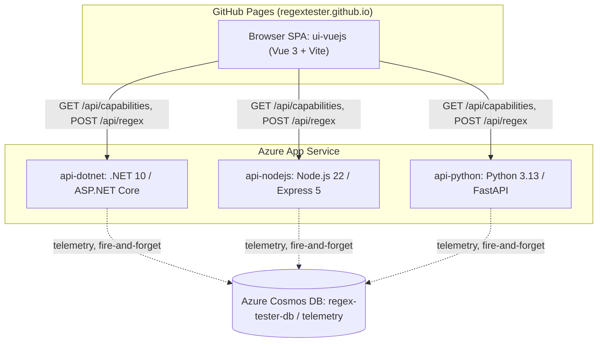
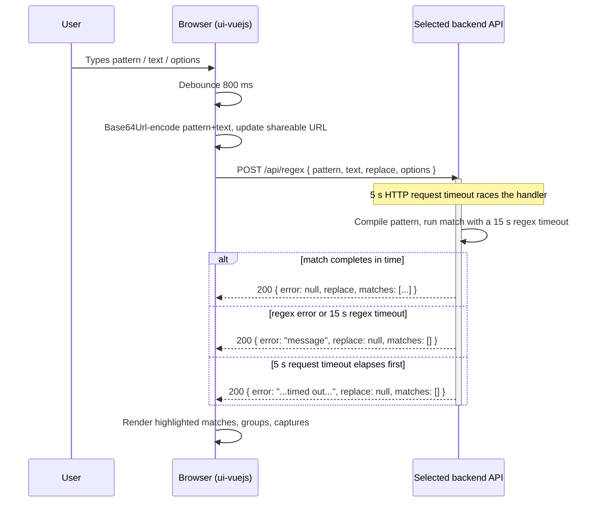

# Architecture

System-level view of RegEx Tester. For a single backend's internal structure, see its own
`ARCHITECTURE.md` ([api-dotnet](api-dotnet/ARCHITECTURE.md), [api-nodejs](api-nodejs/ARCHITECTURE.md),
[api-python](api-python/ARCHITECTURE.md)). There is deliberately **no** `ui-vuejs/ARCHITECTURE.md` —
the frontend has no meaningful internal "pipeline" to document beyond what's already covered here and
in [docs/design/ui-vuejs.md](docs/design/ui-vuejs.md); this file is its architecture document.

## Component overview

The SPA talks to exactly one backend at a time, selected via an engine dropdown; all three
backends are otherwise equivalent from the frontend's point of view because they all implement the
same contract (see below).

## Request flow: one regex evaluation

Every outcome — success, a bad pattern, the 15 s regex timeout, or the 5 s request timeout — is an
HTTP 200 with the result carried in the `error` field. The client never has to special-case an HTTP
error status for a regex-level failure.

## Contract-first design

All three backends implement one canonical OpenAPI 3.1.1 document,
[docs/open-api/regex-tester-api.v1.yaml](docs/open-api/regex-tester-api.v1.yaml), described in
narrative form in [docs/design/api-contract.md](docs/design/api-contract.md). A single
language-agnostic conformance suite ([tests/contract/](tests/contract/), vitest + ajv) validates
every response against that schema plus the behavioural rules in the contract doc, run once per
backend via the `BASE_URL` environment variable. A new backend — the contract doc's own example is
`api-rust` — is contract-compliant the moment this suite passes unmodified against it; no frontend
change is required. See
[docs/design/api-contract.md#6-adding-a-new-backend-eg-rust--checklist](docs/design/api-contract.md#6-adding-a-new-backend-eg-rust--checklist)
for the exact checklist.

## Runtime capability discovery

The frontend does not hard-code which options each engine supports. On every engine switch it
calls `GET /api/capabilities`, which reports `engineKey`, `engineName`, `contractVersion`,
`runtime` (`os`, `framework`), `limits`, `features`, and the full `options[]` registry (each entry
flagged `supported: true/false` for that engine). The UI renders checkboxes only for options the
selected engine actually supports, caches the response, and falls back to a bundled per-engine
config (`ui-vuejs/src/config.dotnet.js` / `config.nodejs.js` / `config.python.js`) if the capability
call fails. Because option bits are a single shared bitmask, bits the current engine doesn't expose
are still preserved and re-sent if the user switches back — switching engines never silently drops
a URL's options.

## Cross-cutting concerns

### CORS

No backend ever returns a wildcard `Access-Control-Allow-Origin`. Each allows
`https://regextester.github.io` plus a configurable allow-list (`AllowCors` / `ALLOW_CORS`), and
additionally reflects `http(s)://localhost[:port]` origins only outside production.

### Timeouts

Two independent timeouts, enforced differently per engine (details in each backend's
`ARCHITECTURE.md` §5):

- **15 s regex timeout** — bounds the match/replace itself. Native in .NET
  (`RegexMatchTimeoutException`); a manual deadline check between matches in Node.js and Python,
  since neither `RegExp` nor `re` has a built-in timeout.
- **5 s HTTP request timeout** — bounds the whole request. All three return **HTTP 200** with
  `{ error: "...timed out...", replace: null, matches: [] }`, never HTTP 408.

### Request body limit and HTTP 413

Every backend caps the raw request body at **8192 bytes**, checked before the body is parsed and
before any field's `maxLength`/`StringLength` is validated. Exceeding it returns HTTP 413 with an
RFC 9457 `ProblemDetails` body. A field that parses but exceeds its own length limit (pattern ≤512,
text/replace ≤1024) returns HTTP 400 with a `ProblemDetails` body and `errors: { field: string[] }`
instead.

### Error semantics

Regex compilation errors and both timeouts are **not** HTTP error codes — they are HTTP 200 with
the `error` field populated and `matches: []`. Only oversized bodies (413) and over-length /
malformed fields (400) are real HTTP error statuses.

### Telemetry

All three backends write an identical 12-field document (`id`, `engineKey`, `timestamp`, `host`,
`userAgent`, `pattern`, `text`, `replace`, `options`, `durationMs`, `matchCount`, `error`) to one
shared Cosmos DB container, `regex-tester-db`/`telemetry`, partitioned on `/timestamp`. Writes are
fire-and-forget on every engine: a Cosmos outage can never affect the response already sent, and an
empty connection string disables telemetry silently without preventing startup. No client IP is
collected. `engineKey` is a plain field on the document, so per-engine queries are cross-partition —
an intentional trade so the partition key stays unchanged and no container ever needs recreating.
See [DEPLOYMENT.md](DEPLOYMENT.md).

## Known deliberate engine divergences

- **Captures**: `GET /api/capabilities` reports `features.captures = "multi"` for api-dotnet
  (`System.Text.RegularExpressions.Group.Captures` retains every capture of a repeated group) and
  `"single"` for api-nodejs and api-python (`RegExp`/`re` only expose the last capture per group).
- **Always-on flags**: api-nodejs always applies the `g` and `d` regex flags internally regardless
  of the `Global`/`HasIndices` option bits, so it always returns every match with full index data;
  those two bits exist in its capability list for display only.
- Several contract option bits are no-ops on some engines (e.g. `ExplicitCapture`, `Compiled`,
  `RightToLeft`, `ECMAScript`, `CultureInvariant`, `NonBacktracking` have no Node.js/Python
  equivalent). Unsupported bits are always ignored silently, never rejected, so one bitmask stays
  portable across all three engines. The full flag table is in
  [docs/design/api-contract.md](docs/design/api-contract.md#3-option-flag-registry).

## Projects

| Project | Architecture doc | Design doc |
|---|---|---|
| `api-dotnet` | [api-dotnet/ARCHITECTURE.md](api-dotnet/ARCHITECTURE.md) | [docs/design/api-dotnet.md](docs/design/api-dotnet.md) |
| `api-nodejs` | [api-nodejs/ARCHITECTURE.md](api-nodejs/ARCHITECTURE.md) | [docs/design/api-nodejs.md](docs/design/api-nodejs.md) |
| `api-python` | [api-python/ARCHITECTURE.md](api-python/ARCHITECTURE.md) | [docs/design/api-python.md](docs/design/api-python.md) |
| `ui-vuejs` | *(this document)* | [docs/design/ui-vuejs.md](docs/design/ui-vuejs.md) |

## See also

- [README.md](README.md) — quick start and project overview
- [DEPLOYMENT.md](DEPLOYMENT.md) — Azure provisioning and CI/CD runbook
- [CLAUDE.md](CLAUDE.md) — contributor/agent guide
