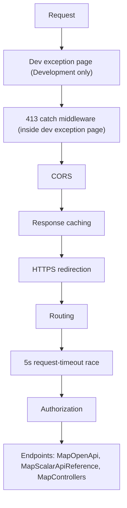

# api-dotnet — Architecture

Internal structure of the .NET backend. For the shared cross-engine contract (endpoints, schemas,
error semantics, the full option flag registry), see [docs/design/api-contract.md](../docs/design/api-contract.md).
For a narrative walkthrough of this backend specifically, see [docs/design/api-dotnet.md](../docs/design/api-dotnet.md).

## 1. Purpose and Tech Stack

One of four interchangeable backends implementing the shared v1 API contract, using
`System.Text.RegularExpressions` as its regex engine.

- **Runtime**: .NET 10.0 / ASP.NET Core, `net10.0` target framework
- **Server**: Kestrel
- **API docs**: `Microsoft.AspNetCore.OpenApi` (`10.*`) + `Scalar.AspNetCore` (`2.*`)
- **Telemetry**: `Microsoft.Azure.Cosmos` `3.48.0`
- **Other dependencies**: `Azure.Identity` `1.13.2`, `Newtonsoft.Json` `13.0.3`

## 2. Directory Layout

```
api-dotnet/
├── Program.cs                      # Entry point; configures Kestrel MaxRequestBodySize (8192 bytes)
├── Startup.cs                      # DI registration + the full middleware pipeline (see §3)
├── Controllers/
│   ├── HomeController.cs           # GET / → 302 redirect
│   ├── CapabilitiesController.cs   # GET /api/capabilities
│   └── RegexController.cs          # POST /api/regex
├── Services/
│   ├── RegExProcessor.cs           # IRegExProcessor — core regex matching (§4, §5)
│   └── TelemetryService.cs         # ITelemetryService — Cosmos DB telemetry (§7)
├── Models/
│   ├── Input.cs                    # Request DTO (pattern/text/replace/options)
│   ├── RegexResult.cs              # Response DTOs (RegexResult, MatchResult, GroupResult, CaptureResult)
│   ├── RegExTesterOptions.cs       # Bitwise flags enum + RegExTesterOptionsRegistry (option registry, EngineKey)
│   └── Capabilities.cs             # CapabilitiesResult, Runtime, Limits, Features, CapabilityOption DTOs
├── appsettings.json                # Production config (AllowCors, Cosmos:*)
├── appsettings.Development.json    # Dev config
└── RegExTester.Api.DotNet.csproj   # Project file / package references
```

## 3. Request Pipeline and Middleware Order

Configured in `Startup.Configure`, in this order:



1. `UseDeveloperExceptionPage()` — Development only.
2. A custom exception-catching middleware, registered immediately *after* (so, in the pipeline,
   immediately *inside*) the developer exception page — it must sit closer to the throw site,
   since `UseDeveloperExceptionPage` swallows exceptions itself rather than rethrowing them. This
   is what turns Kestrel's oversized-body exception into an HTTP 413 response (see §6).
3. `UseCors(...)` — allow-list from `AllowCors` config, plus reflected localhost origins in
   Development only (never a wildcard).
4. `UseResponseCaching()`.
5. `UseHttpsRedirection()`.
6. `UseRouting()`.
7. A custom middleware that races the rest of the pipeline against a 5-second timer (see §5).
8. `UseAuthorization()` (placeholder; no auth is implemented).
9. `UseEndpoints(...)` — `MapOpenApi()`, `MapScalarApiReference()`, `MapControllers()`.

## 4. Regex Engine Specifics

`RegExProcessor` masks the incoming `options` bitmask against `SupportedRegexOptionsMask`
(`IgnoreCase`, `Multiline`, `ExplicitCapture`, `Compiled`, `Singleline`,
`IgnorePatternWhitespace`, `RightToLeft`, `ECMAScript`, `CultureInvariant`, `NonBacktracking`) and
casts the result directly to `System.Text.RegularExpressions.RegexOptions` — no per-bit
translation is needed because `RegExTesterOptions` deliberately reuses `RegexOptions`' own
underlying integer values. `ShowCaptures` (32768) is stripped from the mask before that cast (it
is a custom, non-.NET flag). Every other contract bit (`HasIndices`, `Global`, `Unicode`,
`UnicodeSets`, `Sticky`, `Ascii`, `UnixLines`, `Literal`, `UnicodeCase`, `CanonicalEquivalence`)
is simply absent from the mask, so it's silently ignored rather than rejected.

`GET /api/capabilities` reports `features.captures = "multi"` — the only one of the four engines
to do so — because `System.Text.RegularExpressions.Group.Captures` retains every capture of a
repeated group, not just the last one.

The full contract-wide option flag table (including the permanently-reserved bit 128) lives in
[CLAUDE.md](../CLAUDE.md) and [docs/design/api-contract.md](../docs/design/api-contract.md); this
backend's registry (`RegExTesterOptionsRegistry.All` in `Models/RegExTesterOptions.cs`) is the
runtime source of truth for what `GET /api/capabilities` actually reports.

## 5. Timeout Implementation

- **Regex timeout (15 s)**: `RegExProcessor` constructs `new Regex(pattern, regexOptions,
  TimeSpan.FromSeconds(15))`. The .NET regex engine enforces this natively; a
  `RegexMatchTimeoutException` is caught by the same generic `try/catch` that handles any other
  pattern error, and its message is returned via the `error` field with HTTP 200 — never thrown to
  the client.
- **Request timeout (5 s)**: ASP.NET Core's built-in request-timeout middleware only fires when
  downstream code observes a `CancellationToken`, but `RegExProcessor` runs synchronous, CPU-bound
  matching and never checks one. Instead, a custom middleware races `next(context)` against
  `Task.Delay(5s)` with `Task.WhenAny`. If the timer wins and the response hasn't started, it
  writes an HTTP 200 body (`{ error: "...timed out...", replace: null, matches: [] }`) itself; the
  original request task is left to finish in the background (bounded by the 15 s regex timeout)
  with its result discarded, and its eventual completion is observed via `ContinueWith` so it never
  surfaces as an unobserved task exception.

## 6. Error Handling, and the 400 / 413 Paths

- **400 (validation)**: `ConfigureApiBehaviorOptions.InvalidModelStateResponseFactory` builds an
  RFC 9457 `ValidationProblemDetails` body from `ModelState`, with keys converted to camelCase and
  every value an `string[]` — triggered by `[StringLength]` violations on `Input.Pattern` (512),
  `Input.Text` (1024), `Input.Replace` (1024).
- **413 (body too large)**: `Program.cs` sets Kestrel's `MaxRequestBodySize = 8192`. Exceeding it
  makes Kestrel throw internally (`Microsoft.AspNetCore.Server.Kestrel.Core.BadHttpRequestException`
  — an internal type, detected reflectively via `ex.GetType().Name == "BadHttpRequestException"`
  plus its `StatusCode` property) while the body is being read during model binding. The
  middleware from §3 step 2 catches this, before the body is ever parsed or any field's
  `[StringLength]` is checked, and writes an RFC 9457 `ProblemDetails` 413 response.
- **Regex errors**: any exception from constructing or running the `Regex` (bad pattern, timeout,
  etc.) is caught inside `RegExProcessor.Matches` and returned via the `error` field — always HTTP
  200, never an HTTP error status.

## 7. Telemetry Integration

`TelemetryService` (singleton, `ITelemetryService`) is constructed from `Cosmos:Endpoint` /
`Cosmos:Database` / `Cosmos:Container` config keys. `RegExController.Post` calls
`RecordTelemetry(...)` fire-and-forget, after computing the request's elapsed time with a
`Stopwatch` and after building the regex result — the call never delays or affects the response.

- Internally, `RecordTelemetry` dispatches the actual Cosmos write via `Task.Run(...)` with
  `CancellationToken.None` (not the request's token, which may already be cancelled by the time
  the response has been sent); every exception is caught inside that task and logged at warning
  level, so none can escape as an unobserved task exception.
- The document has 12 fields: `id` (new GUID), `engineKey` (`RegExTesterOptionsRegistry.EngineKey`
  = `"DOTNET"` — the same constant `CapabilitiesController` uses, so the two can never drift),
  `timestamp` (UTC ISO-8601 `"o"` format), `host`, `userAgent`, `pattern`, `text`, `replace`,
  `options` (int bitmask), `durationMs`, `matchCount`, `error`.
- Container `regex-tester-db`/`telemetry` is created (if missing) with manual throughput 400 RU/s
  and partition key `/timestamp`. `CreateItemAsync` passes `new PartitionKey(item.timestamp)`, which
  must always match that path — passing `engineKey` instead would fail every write with
  `PartitionKeyMismatch`, silently, because the surrounding `catch` swallows it.
- An empty `Cosmos:Endpoint` makes `RecordTelemetry` a no-op (client/container stay
  `null`). A bad or unreachable endpoint, a missing role assignment or an unavailable credential is
  caught inside `ConnectAsync`'s own `try/catch` and logged at warning level — it can never prevent
  the app from starting.
- **Authentication is Entra ID, never a key.** `new CosmosClient(endpoint, new DefaultAzureCredential())`
  resolves the App Service managed identity in Azure and the developer's `az login` session locally.
  The identity holds the Cosmos DB Built-in Data Contributor data-plane role.
- **The database and container are never created.** That role grants no control-plane permission, so
  `ConnectAsync` calls `GetDatabase(...).GetContainer(...)` — pure client-side handles — and then a
  single `ReadContainerAsync()`. Without that read, token acquisition and any 403 would be deferred
  to the first write and lost in its catch; with it, misconfiguration surfaces in the startup log.
  The container must already exist (DEPLOYMENT.md §2).
- **Initialization runs at startup, not on first use.** `Startup.Configure` resolves
  `ITelemetryService` eagerly, so the Cosmos handshake happens before Kestrel accepts a request and
  the very first `POST /api/regex` is recorded. Previously the DI factory was lazy: initialization
  ran during the first request, delaying it by the handshake.
- Initialization is bounded at **10 s** (`InitTimeout`). `InitCosmos` runs `ConnectAsync` on a
  `Task.Run` and `Wait`s on it; on expiry it logs a warning and startup proceeds. The bound is
  enforced here rather than with a `CancellationToken` because the Cosmos SDK does not honour one
  promptly against an unreachable endpoint — measured at ~37 s against a blackholed address for a
  10 s token. A connection completing after the bound still publishes its client.

## 8. OpenAPI Generation and Where the Document Is Served

`services.AddOpenApi(...)` (from `Microsoft.AspNetCore.OpenApi`) generates the document at
runtime from controller attributes and XML doc comments (`GenerateDocumentationFile` is enabled in
the `.csproj`), with a document transformer setting the title, version, description and contact.
`OpenApiGenerateDocumentsOnBuild` is deliberately **not** set in the `.csproj`, so no document is
generated at build time — only at runtime, via `endpoints.MapOpenApi()` (served at
`/openapi/v1.json`) and `endpoints.MapScalarApiReference()` (interactive UI at `/scalar/v1`). The
checked-in snapshot at [docs/open-api/api-dotnet.v1.json](../docs/open-api/api-dotnet.v1.json) is
produced by running the app and fetching that endpoint, not by an automated build step.

## 9. Local Development Commands

```powershell
dotnet build                   # Build the project
dotnet run                     # Dev server: https://localhost:5001, http://localhost:5000
dotnet publish -c Release      # Production publish
```

Conformance suite (from `tests/contract/`, against a running instance of this backend):

```powershell
$env:BASE_URL = "http://localhost:5000"; npx vitest run
```

## 10. Related Documentation

- [docs/design/api-dotnet.md](../docs/design/api-dotnet.md) — narrative design doc for this backend
- [docs/design/api-contract.md](../docs/design/api-contract.md) — the shared v1 contract (endpoints, schemas, full option flag table, error semantics)
- [docs/open-api/regex-tester-api.v1.yaml](../docs/open-api/regex-tester-api.v1.yaml) — canonical OpenAPI document
- [../ARCHITECTURE.md](../ARCHITECTURE.md) — system-level architecture
- [../CLAUDE.md](../CLAUDE.md) — repository-wide contributor guide
