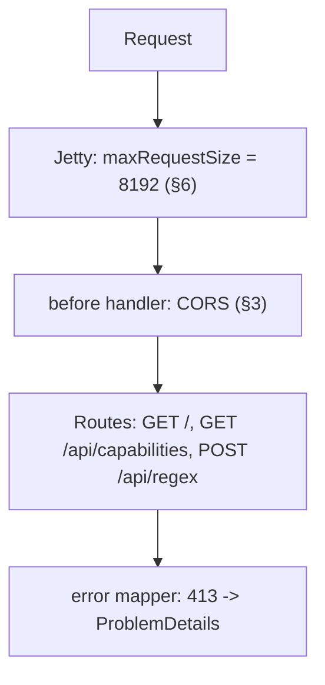

# api-java — Architecture

Internal structure of the Java backend. For the shared cross-engine contract (endpoints, schemas,
error semantics, the full option flag registry), see
[docs/design/api-contract.md](../docs/design/api-contract.md). For a narrative walkthrough of this
backend specifically, see [docs/design/api-java.md](../docs/design/api-java.md).

## 1. Purpose and Tech Stack

One of four interchangeable backends implementing the shared v1 API contract, using only the JDK's
built-in `java.util.regex` package (no third-party regex library) as its regex engine.

- **Runtime**: Java 21 (LTS). Java 20 is the effective floor because of `Pattern.namedGroups()` (§4)
- **Framework**: Javalin `6.7.0` (embedded Jetty 11, no DI container)
- **Build**: Maven; `maven-shade-plugin` produces an executable `target/app.jar`
- **OpenAPI**: `javalin-openapi-plugin` + `javalin-swagger-plugin` `6.7.0-1`, generated at compile time
- **JSON**: `jackson-databind` `2.18.2`
- **Logging**: `slf4j-simple` `2.0.16`, routed to stdout by `simplelogger.properties` (§8)
- **Telemetry**: `azure-cosmos` `4.65.0`, `azure-identity` `1.15.0`

Javalin replaced Spring Boot in 2026-08 purely for startup time: **2.31 s → 0.70 s** for a byte-identical
contract, which matters because the F1 App Service plan cannot enable Always On, so every idle period
ends in a full cold start. See [docs/plan/2026-08-30-api-java-javalin.md](../docs/plan/2026-08-30-api-java-javalin.md).

The jar's `finalName` is pinned to `app` because Azure App Service's Java SE runtime launches
`java -jar /home/site/wwwroot/app.jar` by default; a fixed name means no startup command has to be
configured.

## 2. Directory Layout

```
api-java/
├── src/main/java/io/github/regextester/api/
│   ├── App.java                           # Entry point: routes, CORS, validation, timeout, 413 (§3)
│   ├── model/                             # Records mirroring the v1 contract schemas
│   │   ├── Input.java                     # Request body; @OpenApiStringValidation documents the limits
│   │   ├── RegexResult.java               # { error, replace, matches[] }
│   │   ├── MatchResult.java / GroupResult.java / CaptureResult.java
│   │   ├── Capabilities.java              # GET /api/capabilities response shape
│   │   └── ProblemDetailsResponse.java    # RFC 9457 body for 400 and 413
│   ├── options/
│   │   └── RegexOptions.java              # Option flag registry + bitmask -> Pattern flags (§4)
│   └── service/
│       ├── RegexProcessor.java            # Core java.util.regex matching/replace engine (§4, §5)
│       ├── CapabilitiesService.java       # Builds the capability document; owns ENGINE_KEY
│       ├── TimeLimitedCharSequence.java   # Deadline-enforcing CharSequence (§5)
│       └── TelemetryService.java          # Cosmos DB telemetry (§7)
├── src/main/resources/simplelogger.properties
└── pom.xml
```

There is no `controller/`, `config/` or `filter/` package: without a DI container every HTTP concern
lives in `App`, and the services are plain objects it constructs directly. The engine classes
(`RegexProcessor`, `CapabilitiesService`, the models, `RegexOptions`) carry no framework annotations
at all beyond the compile-time OpenAPI ones, which is what made the Spring → Javalin swap a change to
one file rather than a rewrite.

## 3. Request Pipeline



1. **CORS** runs in a `before` handler so it also applies to error responses. It reflects the
   *specific* `Origin` — never `*` — for `https://regextester.github.io`, anything in `ALLOW_CORS`,
   and `http(s)://localhost[:port]` when `ENVIRONMENT != production`. A disallowed origin simply
   receives no CORS header. This is why the Spring version needed a highest-precedence `CorsFilter`
   rather than mapping-based CORS: a 413 with no CORS headers surfaces in the browser as an opaque
   network error instead of the real status.
2. **Routes** are registered explicitly; `POST /api/regex` submits the match to a daemon worker pool
   so the 5 s bound can be applied (§5).
3. **`app.error(413, ...)`** replaces Jetty's plain-text body with the contract's RFC 9457
   ProblemDetails shape (§6).

## 4. Regex Engine Specifics

`options/RegexOptions.java`'s `SUPPORTED_PATTERN_FLAGS` maps exactly nine contract bits to native
`Pattern` flags: `IgnoreCase`→`CASE_INSENSITIVE`, `Multiline`→`MULTILINE`, `Singleline`→`DOTALL`,
`IgnorePatternWhitespace`→`COMMENTS`, `Unicode`→`UNICODE_CHARACTER_CLASS` (which also implies
`UNICODE_CASE`), `UnixLines`→`UNIX_LINES`, `Literal`→`LITERAL`, `UnicodeCase`→`UNICODE_CASE` and
`CanonicalEquivalence`→`CANON_EQ`. `toPatternFlags()` only iterates this map, so every other
contract bit (`ExplicitCapture`, `Compiled`, `RightToLeft`, `ECMAScript`, `CultureInvariant`,
`NonBacktracking`, `HasIndices`, `Global`, `UnicodeSets`, `Sticky`, `Ascii`) is silently ignored
rather than rejected. `ShowCaptures` (32768) is tested separately and never reaches
`toPatternFlags()`.

The map is built with `Map.of`, which accepts at most 10 key/value pairs and now holds 9. **Adding a
tenth flag is fine; an eleventh requires switching to `Map.ofEntries`.**

The last four bits are supported *only* here — no other backend offers a native equivalent, which
makes this engine the sole reason they exist in the registry at all.

Three engine-specific notes:

- **`Ascii` (131072) is unsupported here on purpose.** It is not an omission: `\w`, `\d` and `\b`
  are already ASCII-only in Java by default, so the bit would be a no-op. Java's Unicode-aware
  behaviour is opt-*in* via `Unicode`, the exact inverse of Python, where matching is Unicode-aware
  by default and `re.ASCII` opts out.
- **`UnicodeCase` (1048576) overlaps `Unicode` (8192).** `UNICODE_CHARACTER_CLASS` implies
  `UNICODE_CASE`, so bit 8192 already switches casing to Unicode rules. The separate bit exists so a
  caller can request Unicode case folding *without* Unicode-aware `\w`, `\d`, `\s` and `\b`; setting
  both is harmless and equivalent to setting `Unicode` alone.

- **No pattern translation is needed.** Java spells named groups `(?<name>...)`, the same as .NET
  and JavaScript, so api-python's `(?P<name>...)` rewriting has no counterpart here. Java is
  stricter about the name itself, though: it accepts only `[a-zA-Z][a-zA-Z0-9]*`, so a pattern like
  `(?<my_group>x)` compiles on the other three engines and is a syntax error on this one — surfaced
  as a normal `error` string, per contract.

`RegexProcessor` recovers group names from `Pattern.namedGroups()` (added in Java 20), which returns
a name→number map that it inverts. This is why the project requires Java 21: before that method
existed, the only option was re-parsing the pattern text with another regex, which is fragile around
lookbehind (`(?<=...)`) and escaped parentheses.

`toJavaReplacement()` rewrites the replacement template rather than the pattern. `$1` and
`${name}` mean the same thing in both dialects and pass through untouched; only escaping differs —
the contract spells a literal dollar `$$` where Java spells it `\$`, and Java treats a bare
backslash as an escape character rather than a literal, so literal backslashes are doubled.

`GET /api/capabilities` reports `features.captures = "single"` — `Matcher` only exposes the last
capture per group, so `ShowCaptures` yields a single-element `captures` array per group/match, the
same as api-nodejs and api-python.

The full contract-wide option flag table lives in [CLAUDE.md](../CLAUDE.md) and
[docs/design/api-contract.md](../docs/design/api-contract.md); `RegexOptions.REGISTRY` is the
runtime source of truth for what this engine actually reports.

## 5. Timeout Implementation

- **Regex timeout (15 s)**: `java.util.regex` has no native timeout, and `Thread.stop()` — the old
  way to kill a runaway match — was removed in Java 20. Instead `RegexProcessor` wraps the input in
  a `TimeLimitedCharSequence`, which checks a `System.nanoTime()` deadline every 1024 `charAt()`
  calls and throws once it passes. Because the matcher must call `charAt()` to make progress, this
  preempts even a single catastrophically backtracking match — which the between-match deadline
  checks used by api-python and api-nodejs cannot do. `subSequence()` inherits the same absolute
  deadline, and one wrapper covers both the matching pass and the replacement pass so a pathological
  pattern cannot spend 15 s on each.
- **Request timeout (5 s)**: `App` submits the match to a cached daemon pool and bounds it with
  `Future.get(5, SECONDS)`. On expiry the task is cancelled and the response is
  `200 { error: "...timed out...", replace: null, matches: [] }` — never 408. The worker keeps
  running until its own 15 s regex deadline fires, but the client-facing response is returned within
  5 s regardless.

In practice the request timeout almost always wins, since 5 s < 15 s; the regex deadline exists to
stop the abandoned worker thread from burning a core indefinitely.

## 6. Error Handling, and the 400 / 413 Paths

- **400 (validation)**: `App.validate` checks `pattern` ≤ 512 and `text`/`replace` ≤ 1024 and builds
  an RFC 9457 ProblemDetails body with `errors: { field: string[] }`. Each field maps to an *array*
  even though only one violation per field is possible, because the contract requires that shape on
  every engine.
- **413 (body too large)**: `cfg.http.maxRequestSize = 8192` makes Jetty reject the body as it is
  read, and `app.error(413, ...)` replaces the default plain-text body with ProblemDetails JSON.
  This satisfies the contract's ordering requirement — an oversized body is 413 even when one of its
  fields would also have failed its `maxLength` check — because the limit is enforced during the
  read, before `validate` ever runs.
- **Regex errors**: `PatternSyntaxException` at compile time, and any runtime failure during
  matching or `replaceAll` (such as `$9` with no group 9), are caught inside `RegexProcessor.match()`
  and returned via the `error` field — always HTTP 200, never an HTTP error status. A failed
  replacement keeps the matches already found, mirroring api-python.

## 7. Telemetry Integration

`TelemetryService`'s `init()`, called from `App.main` before `app.start(...)`, reads
`COSMOS_ENDPOINT`/`COSMOS_DATABASE`/`COSMOS_CONTAINER` (defaulting to `regex-tester-db`/`telemetry`).
An empty endpoint makes it a silent no-op. The connection attempt **blocks startup**: it is submitted
to the same single-threaded daemon executor used for writes and then joined with
`Future.get(10, SECONDS)`, so the server does not begin listening until the client is ready or the
bound expires. Running it fire-and-forget, as it did before, meant the first requests after every
restart lost their telemetry silently. `shutdown()` is wired to a JVM shutdown hook.

**Authentication is Entra ID, never a key.** The client is built with
`new CosmosClientBuilder().endpoint(endpoint).credential(new DefaultAzureCredentialBuilder().build())`,
resolving the App Service managed identity in Azure and the developer's `az login` session locally.
This also removed the hand-rolled `AccountEndpoint=...;AccountKey=...` parser this class used to
need, since the Java SDK has no connection-string factory: an endpoint URI needs no parsing.

The identity holds the Cosmos DB Built-in Data Contributor data-plane role, which grants no
control-plane permission, so the database and container are **never created**:
`getDatabase(...).getContainer(...)` builds a handle and a single `cont.read()` verifies access.
Without that read, token acquisition and any 403 would be deferred to the first write and lost in
its catch. The container must already exist (DEPLOYMENT.md §2).

The executor is used purely so the wait can be bounded — the Java Cosmos SDK offers no per-call
timeout for these operations. On `TimeoutException` the warning is logged, startup proceeds, and the
abandoned attempt is left to finish; if it eventually succeeds it legitimately leaves a usable
client behind. Any other failure is caught, logged at warning level, and leaves telemetry disabled
for that process.

Per request, `App` builds the document and calls `send()`, which queues the write on the
daemon executor and returns immediately; the executor task swallows every exception. So telemetry is
fire-and-forget in both directions — it cannot delay the response, and a Cosmos outage can never
surface anywhere visible to the client.

The document has 12 fields, matching the other three backends exactly: `id` (`UUID.randomUUID()`),
`engineKey` (`ENGINE_KEY` from `CapabilitiesService` = `"JAVA"` — the same constant
`GET /api/capabilities` uses), `timestamp` (UTC ISO-8601, via `Instant.now()`), `host`, `userAgent`,
`pattern`, `text`, `replace`, `options`, `durationMs`, `matchCount`, `error`. The container is
provisioned out of band, partitioned on `/timestamp`.

## 8. OpenAPI Generation and Where the Document Is Served

`javalin-openapi`'s annotation processor reads the `@OpenApi` annotations on `App`'s handlers and the
model records **during compilation** and emits the document into the jar. `OpenApiPlugin` serves it
at `/openapi/v1.json` and `SwaggerPlugin` mounts the explorer at `/scalar/v1` (despite the route
name, this backend uses Swagger UI, not the Scalar package — the same as api-nodejs).

Compile-time generation is the reason springdoc was replaced rather than merely reconfigured: the
document still cannot drift from the handlers, but the ~0.29 s springdoc spent scanning at startup
becomes zero rather than moving elsewhere.

Two consequences worth knowing when regenerating
[docs/open-api/api-java.v1.json](../docs/open-api/api-java.v1.json):

- `@OpenApiStringValidation` takes a `String`, so `Input`'s `maxLength` values are emitted as JSON
  strings (`"512"`) rather than numbers. `GET /api/capabilities` remains the correctly-typed,
  authoritative source for the limits.
- The generator emits `parameters: []`, `deprecated: false` and `security: []` on every operation.
  This is noise, not meaning.

## 9. Javalin Pitfalls

Two traps that cost real debugging time during the migration and will recur if `App` is edited
carelessly:

- **Rethrow `HttpResponseException` from the `bodyAsClass` catch.** Javalin enforces
  `maxRequestSize` by throwing *while the body is being read* — from inside the same call that also
  throws on malformed JSON. A broad `catch (Exception e)` therefore reports an oversized body as a
  400 JSON-syntax error, and the conformance suite fails with "expected 400 to be 413". Catch
  `HttpResponseException` first and rethrow it so the 413 mapper runs.
- **slf4j-simple writes to `System.err` by default**, which App Service's log stream classifies as
  errors — every ordinary log line would appear as a failure. `simplelogger.properties` redirects it
  to stdout, matching what Spring Boot's logback did.

## 10. Related documents

- [docs/design/api-java.md](../docs/design/api-java.md) — narrative design document
- [docs/design/api-contract.md](../docs/design/api-contract.md) — the shared v1 contract
- [docs/open-api/regex-tester-api.v1.yaml](../docs/open-api/regex-tester-api.v1.yaml) — canonical OpenAPI document
- [docs/plan/2026-08-30-api-java-javalin.md](../docs/plan/2026-08-30-api-java-javalin.md) — why Javalin replaced Spring Boot
