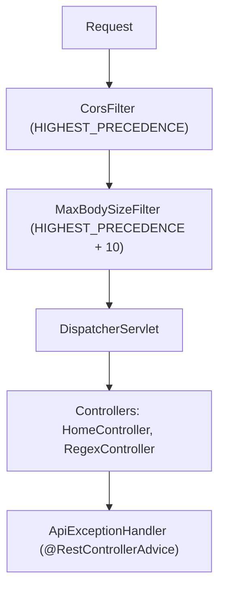

# api-java — Architecture

Internal structure of the Java backend. For the shared cross-engine contract (endpoints, schemas,
error semantics, the full option flag registry), see
[docs/design/api-contract.md](../docs/design/api-contract.md). For a narrative walkthrough of this
backend specifically, see [docs/design/api-java.md](../docs/design/api-java.md).

## 1. Purpose and Tech Stack

One of four interchangeable backends implementing the shared v1 API contract, using only the JDK's
built-in `java.util.regex` package (no third-party regex library) as its regex engine.

- **Runtime**: Java 21 (LTS). Java 20 is the effective floor because of `Pattern.namedGroups()` (§4)
- **Framework**: Spring Boot `3.4.1` (Spring MVC on embedded Tomcat 10.1)
- **Build**: Maven; `spring-boot-maven-plugin` produces an executable `target/app.jar`
- **OpenAPI**: `springdoc-openapi-starter-webmvc-ui` `2.7.0`
- **Telemetry**: `azure-cosmos` `4.65.0`

The jar's `finalName` is pinned to `app` because Azure App Service's Java SE runtime launches
`java -jar /home/site/wwwroot/app.jar` by default; a fixed name means no startup command has to be
configured.

## 2. Directory Layout

```
api-java/
├── src/main/java/io/github/regextester/api/
│   ├── Application.java                  # Spring Boot entry point
│   ├── config/
│   │   ├── CorsConfig.java               # CorsFilter registered at highest precedence (§3)
│   │   └── OpenApiConfig.java            # OpenAPI document metadata
│   ├── controller/
│   │   ├── HomeController.java           # GET / (302 redirect), GET /api/capabilities
│   │   ├── RegexController.java          # POST /api/regex — returns Callable, dispatches telemetry
│   │   └── ApiExceptionHandler.java      # 400 / 413 / async-timeout handling (§5, §6)
│   ├── filter/
│   │   └── MaxBodySizeFilter.java        # Enforces maxRequestBodyBytes (8192) -> HTTP 413 (§6)
│   ├── model/                            # Records mirroring the v1 contract schemas
│   │   ├── Input.java                    # Request body + jakarta.validation @Size constraints
│   │   ├── RegexResult.java              # { error, replace, matches[] }
│   │   ├── MatchResult.java / GroupResult.java / CaptureResult.java
│   │   ├── Capabilities.java             # GET /api/capabilities response shape
│   │   └── ProblemDetailsResponse.java   # RFC 9457 body for 400 and 413
│   ├── options/
│   │   └── RegexOptions.java             # Option flag registry + bitmask -> Pattern flags (§4)
│   └── service/
│       ├── RegexProcessor.java           # Core java.util.regex matching/replace engine (§4, §5)
│       ├── CapabilitiesService.java      # Builds the capability document; owns ENGINE_KEY
│       ├── TimeLimitedCharSequence.java  # Deadline-enforcing CharSequence (§5)
│       └── TelemetryService.java         # Cosmos DB telemetry (§7)
├── src/main/resources/application.properties
└── pom.xml
```

## 3. Request Pipeline and Filter Order

Servlet filters run outside the `DispatcherServlet`, so anything they short-circuit never reaches
Spring MVC's routing, validation or exception resolution.



1. `CorsFilter`, registered by `CorsConfig` as a `FilterRegistrationBean` at
   `Ordered.HIGHEST_PRECEDENCE`. Registering it as a filter rather than via `WebMvcConfigurer`'s
   mapping-based CORS is deliberate: mapping-based CORS is applied inside the `DispatcherServlet`,
   so a 413 produced by the next filter would carry no CORS headers and a browser would report an
   opaque network error instead of the real status.
2. `MaxBodySizeFilter` at `HIGHEST_PRECEDENCE + 10` — after CORS (so its response is readable
   cross-origin) but still ahead of the `DispatcherServlet` (§6).
3. `DispatcherServlet` routes to the controllers; `POST /api/regex` returns a `Callable`, which
   starts an async dispatch (§5).
4. `ApiExceptionHandler`, a `@RestControllerAdvice`, takes precedence over Spring's
   `DefaultHandlerExceptionResolver` for the exception types it declares.

## 4. Regex Engine Specifics

`options/RegexOptions.java`'s `SUPPORTED_PATTERN_FLAGS` maps exactly nine contract bits to native
`Pattern` flags: `IgnoreCase`→`CASE_INSENSITIVE`, `Multiline`→`MULTILINE`, `Singleline`→`DOTALL`,
`IgnorePatternWhitespace`→`COMMENTS`, `Unicode`→`UNICODE_CHARACTER_CLASS` (which also implies
`UNICODE_CASE`), `UnixLines`→`UNIX_LINES`, `Literal`→`LITERAL`, `UnicodeCase`→`UNICODE_CASE` and
`CanonicalEquivalence`→`CANON_EQ`. `toPatternFlags()` only iterates this map, so every other
contract bit (`ExplicitCapture`, `Compiled`, `RightToLeft`, `ECMAScript`, `CultureInvariant`,
`NonBacktracking`, `HasIndices`, `Global`, `UnicodeSets`, `Sticky`, `Ascii`) is silently ignored
rather than rejected. `ShowCaptures` (32768) is tested separately and never reaches
`toPatternFlags()`.

The map is built with `Map.of`, which accepts at most 10 key/value pairs and now holds 9. **Adding a
tenth flag is fine; an eleventh requires switching to `Map.ofEntries`.**

The last four bits are supported *only* here — no other backend offers a native equivalent, which
makes this engine the sole reason they exist in the registry at all.

Three engine-specific notes:

- **`Ascii` (131072) is unsupported here on purpose.** It is not an omission: `\w`, `\d` and `\b`
  are already ASCII-only in Java by default, so the bit would be a no-op. Java's Unicode-aware
  behaviour is opt-*in* via `Unicode`, the exact inverse of Python, where matching is Unicode-aware
  by default and `re.ASCII` opts out.
- **`UnicodeCase` (1048576) overlaps `Unicode` (8192).** `UNICODE_CHARACTER_CLASS` implies
  `UNICODE_CASE`, so bit 8192 already switches casing to Unicode rules. The separate bit exists so a
  caller can request Unicode case folding *without* Unicode-aware `\w`, `\d`, `\s` and `\b`; setting
  both is harmless and equivalent to setting `Unicode` alone.

- **No pattern translation is needed.** Java spells named groups `(?<name>...)`, the same as .NET
  and JavaScript, so api-python's `(?P<name>...)` rewriting has no counterpart here. Java is
  stricter about the name itself, though: it accepts only `[a-zA-Z][a-zA-Z0-9]*`, so a pattern like
  `(?<my_group>x)` compiles on the other three engines and is a syntax error on this one — surfaced
  as a normal `error` string, per contract.

`RegexProcessor` recovers group names from `Pattern.namedGroups()` (added in Java 20), which returns
a name→number map that it inverts. This is why the project requires Java 21: before that method
existed, the only option was re-parsing the pattern text with another regex, which is fragile around
lookbehind (`(?<=...)`) and escaped parentheses.

`toJavaReplacement()` rewrites the replacement template rather than the pattern. `$1` and
`${name}` mean the same thing in both dialects and pass through untouched; only escaping differs —
the contract spells a literal dollar `$$` where Java spells it `\$`, and Java treats a bare
backslash as an escape character rather than a literal, so literal backslashes are doubled.

`GET /api/capabilities` reports `features.captures = "single"` — `Matcher` only exposes the last
capture per group, so `ShowCaptures` yields a single-element `captures` array per group/match, the
same as api-nodejs and api-python.

The full contract-wide option flag table lives in [CLAUDE.md](../CLAUDE.md) and
[docs/design/api-contract.md](../docs/design/api-contract.md); `RegexOptions.REGISTRY` is the
runtime source of truth for what this engine actually reports.

## 5. Timeout Implementation

- **Regex timeout (15 s)**: `java.util.regex` has no native timeout, and `Thread.stop()` — the old
  way to kill a runaway match — was removed in Java 20. Instead `RegexProcessor` wraps the input in
  a `TimeLimitedCharSequence`, which checks a `System.nanoTime()` deadline every 1024 `charAt()`
  calls and throws once it passes. Because the matcher must call `charAt()` to make progress, this
  preempts even a single catastrophically backtracking match — which the between-match deadline
  checks used by api-python and api-nodejs cannot do. `subSequence()` inherits the same absolute
  deadline, and one wrapper covers both the matching pass and the replacement pass so a pathological
  pattern cannot spend 15 s on each.
- **Request timeout (5 s)**: `spring.mvc.async.request-timeout=5000` applies to the `Callable`
  returned by `RegexController`. On expiry Spring raises `AsyncRequestTimeoutException`, which
  `ApiExceptionHandler` converts into `200 { error: "...timed out...", replace: null, matches: [] }`
  — never 408, and never Spring's default 503. The worker thread keeps running until its own 15 s
  regex deadline fires, but the client-facing response is returned within 5 s regardless.

In practice the request timeout almost always wins, since 5 s < 15 s; the regex deadline exists to
stop the abandoned worker thread from burning a core indefinitely.

## 6. Error Handling, and the 400 / 413 Paths

- **400 (validation)**: `Input`'s `jakarta.validation` `@Size` constraints (`pattern` ≤ 512,
  `text`/`replace` ≤ 1024) make Spring raise `MethodArgumentNotValidException`;
  `ApiExceptionHandler` converts it into an RFC 9457 ProblemDetails body with
  `errors: { field: string[] }`, grouping multiple messages per field.
- **413 (body too large)**: `MaxBodySizeFilter` checks `Content-Length` first and rejects
  immediately without reading the body. Otherwise — no `Content-Length`, chunked transfer-encoding,
  or an understated length — it wraps the `ServletInputStream` to count bytes as they stream in and
  throws `BodyTooLargeException` the moment the total crosses 8192. Running as a filter guarantees
  the contract's ordering requirement: an oversized body is reported as 413 even when one of its
  fields would also have failed its `maxLength` check. Because Spring wraps body-read failures in
  `HttpMessageNotReadableException` before the filter's own `catch` can see them,
  `ApiExceptionHandler` unwraps that exception's cause chain and re-issues the 413; the filter's
  `catch` remains as a backstop for reads that happen outside the `DispatcherServlet`.
- **Regex errors**: `PatternSyntaxException` at compile time, and any runtime failure during
  matching or `replaceAll` (such as `$9` with no group 9), are caught inside `RegexProcessor.match()`
  and returned via the `error` field — always HTTP 200, never an HTTP error status. A failed
  replacement keeps the matches already found, mirroring api-python.

## 7. Telemetry Integration

`TelemetryService`'s `@PostConstruct init()` reads `COSMOS_CONNECTION_STRING`/`COSMOS_DATABASE`/
`COSMOS_CONTAINER` (defaulting to `regex-tester-db`/`telemetry`). An empty connection string makes
it a silent no-op. Crucially, the connection attempt itself is submitted to the same single-threaded
daemon executor used for writes rather than running inline, so an unreachable Cosmos account delays
neither application startup nor the first request; any failure is caught and logged at warning level
and leaves telemetry permanently disabled for that process.

The Java Cosmos SDK has no connection-string factory method (unlike the .NET, Node.js and Python
SDKs), so `buildClient()` parses `AccountEndpoint=...;AccountKey=...` by hand, splitting each
segment on its *first* `=` only so that the key's base64 padding survives.

Per request, `RegexController` builds the document and calls `send()`, which queues the write on the
daemon executor and returns immediately; the executor task swallows every exception. So telemetry is
fire-and-forget in both directions — it cannot delay the response, and a Cosmos outage can never
surface anywhere visible to the client.

The document has 12 fields, matching the other three backends exactly: `id` (`UUID.randomUUID()`),
`engineKey` (`ENGINE_KEY` from `CapabilitiesService` = `"JAVA"` — the same constant
`GET /api/capabilities` uses), `timestamp` (UTC ISO-8601, via `Instant.now()`), `host`, `userAgent`,
`pattern`, `text`, `replace`, `options`, `durationMs`, `matchCount`, `error`. The database is
created (if missing) with 400 RU/s manual throughput and the container with partition key
`/timestamp`.
