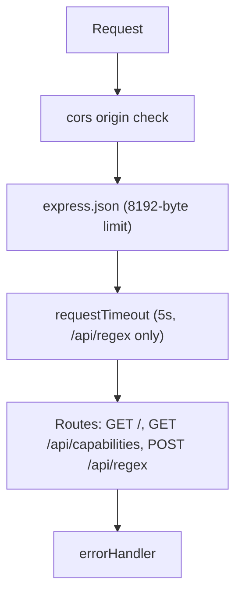

# api-nodejs — Architecture

Internal structure of the Node.js backend. For the shared cross-engine contract (endpoints,
schemas, error semantics, the full option flag registry), see
[docs/design/api-contract.md](../docs/design/api-contract.md). For a narrative walkthrough of this
backend specifically, see [docs/design/api-nodejs.md](../docs/design/api-nodejs.md).

## 1. Purpose and Tech Stack

One of four interchangeable backends implementing the shared v1 API contract, using JavaScript's
native `RegExp` as its regex engine.

- **Runtime**: Node.js `>=22.0.0` (ES modules, per `package.json` `engines`)
- **Framework**: Express `5.1.0`
- **API docs**: `swagger-ui-express` `5.0.1` + a custom JSDoc `@openapi` parser (`js-yaml` `4.1.1`)
- **Telemetry**: Cosmos DB REST API over `fetch` — no SDK in the deployed package (§7)
- **Other dependencies**: `cors` `2.8.5`

## 2. Directory Layout

```
api-nodejs/
├── src/
│   ├── index.js                    # Express app: CORS, body parsing, routes, middleware order (§3)
│   ├── openapi.js                  # OpenAPI doc generator — parses @openapi JSDoc blocks (§8)
│   ├── schemas.js                  # Component schemas, authored as @openapi JSDoc
│   ├── controllers/
│   │   ├── homeController.js       # GET / (redirect), GET /api/capabilities
│   │   └── regexController.js      # POST /api/regex — validation, matching, telemetry dispatch
│   ├── services/
│   │   ├── regexProcessor.js       # Core JS regex engine (§4, §5)
│   │   ├── capabilities.js         # Option registry, limits, ENGINE_KEY, MAX_REQUEST_BODY_BYTES
│   │   └── telemetryService.js     # Cosmos DB telemetry (§7)
│   └── middleware/
│       ├── requestTimeout.js       # 5s HTTP timeout, mounted on /api/regex only (§5)
│       └── errorHandler.js         # Final error-handling middleware — 413/400/500 (§6)
└── package.json
```

## 3. Request Pipeline and Middleware Order

Assembled in `src/index.js`, in this order:



1. `cors(...)` — a custom `origin` callback allows `https://regextester.github.io`, any
   `ALLOW_CORS` origin, and any `http(s)://localhost[:port]` origin, in every environment (no
   dev/production distinction, unlike the other two backends).
2. `express.json({ limit: MAX_REQUEST_BODY_BYTES })` — body parsing, capped at 8192 bytes.
3. `requestTimeout(5000)`, mounted only on the `/api/regex` path.
4. OpenAPI routes (`/openapi/v1.json`, `/scalar/v1`) and the three contract routes (`GET /`,
   `GET /api/capabilities`, `POST /api/regex`).
5. `errorHandler` — registered last (Express requires 4-arg error middleware to be last) so it
   catches errors raised by earlier middleware, notably `express.json()`'s
   `PayloadTooLargeError`/`SyntaxError`.

## 4. Regex Engine Specifics

`regexProcessor.js`'s `buildFlags()` always prepends `gd` to the flags string — `Global` (4096)
and `HasIndices` (2048) are applied unconditionally, regardless of whether the caller set those
option bits, so that every non-overlapping match is always returned with full index data (a
requirement for cross-engine parity of a shared URL). Those two bits remain listed in
`GET /api/capabilities` purely for display; they are true no-ops for match extraction. Beyond
that: `IgnoreCase`→`i`, `Multiline`→`m`, `Singleline`→`s`, `Unicode`→`u`, `UnicodeSets`→`v`,
`Sticky`→`y` (deliberately *not* forced on, since it changes match position). `IgnorePatternWhitespace`
(32) has no native RegExp flag equivalent; instead, `stripComments()` rewrites the pattern *text*
itself, deleting unescaped whitespace and `#`-prefixed comments before the `RegExp` is constructed.
`ShowCaptures` (32768) is masked out before `buildFlags()` runs. Every remaining contract bit
(`ExplicitCapture`, `Compiled`, `RightToLeft`, `ECMAScript`, `CultureInvariant`, `NonBacktracking`,
`Ascii`, `UnixLines`, `Literal`, `UnicodeCase`, `CanonicalEquivalence`) has no corresponding branch,
so it's silently ignored.

`GET /api/capabilities` reports `features.captures = "single"` — `String.matchAll`/`RegExp` only
exposes the last capture per group.

The full contract-wide option flag table lives in [CLAUDE.md](../CLAUDE.md) and
[docs/design/api-contract.md](../docs/design/api-contract.md); `src/services/capabilities.js`'s
`OPTION_REGISTRY` is the runtime source of truth for what this engine actually reports.

## 5. Timeout Implementation

- **Regex timeout (15 s)**: `RegexProcessor.match` computes `deadline = Date.now() + 15_000` before
  iterating `text.matchAll(regex)` (which always includes the forced `g` flag). The deadline is
  checked once per match found in the loop; if exceeded, it returns an error message with empty
  matches. This bounds *between-match* time only — it cannot preempt a single catastrophically
  backtracking match step, since JS has no built-in regex timeout.
- **Request timeout (5 s)**: `requestTimeout(ms)` middleware starts a `setTimeout`; if it fires
  before the response finishes, it sends an HTTP 200 body (`{ error: "...timed out...", replace:
  null, matches: [] }`) directly. The timer is cleared on the response's `finish` event if the
  handler completes first. Unlike the .NET/Python implementations, this does not abort or race
  against the underlying handler — it only guards the client-facing response.

## 6. Error Handling, and the 400 / 413 Paths

- **400 (validation)**: `regexController.match` manually checks `pattern`/`text`/`replace` lengths
  (512/1024/1024) and returns an RFC 9457 ProblemDetails body (`errors: { field: string[] }`)
  directly — there's no framework-level model validation here, unlike .NET/Python. Malformed JSON
  request bodies are instead caught later, in `errorHandler`, as a `SyntaxError`/`entity.parse.failed`.
- **413 (body too large)**: `express.json({ limit: MAX_REQUEST_BODY_BYTES })` throws a
  `PayloadTooLargeError` (`err.type === 'entity.too.large'`) before the route handler runs;
  `errorHandler` catches it and returns an RFC 9457 ProblemDetails 413 response.
- **Regex errors**: any exception from constructing or executing the `RegExp` is caught inside
  `RegexProcessor.match`'s `try/catch` and returned via the `error` field — always HTTP 200, never
  an HTTP error status.
- Anything else reaching `errorHandler` (an uncaught exception elsewhere) becomes a generic HTTP
  500 ProblemDetails body, with the real error logged server-side only.

## 7. Telemetry Integration

`src/services/telemetryService.js` exports `initCosmos()` and `sendTelemetry()`. `initCosmos` is
**awaited** at startup in `index.js`, before `app.listen(...)`, with
`COSMOS_ENDPOINT`/`COSMOS_DATABASE`/`COSMOS_CONTAINER` (defaulting to
`regex-tester-db`/`telemetry`), so the Cosmos client exists before the first request arrives.
Previously the promise was left unawaited and the server began serving immediately, silently
dropping the telemetry of every request that beat the handshake.

**Authentication is Entra ID, never a key, and there is no Azure SDK in production.** Both the
token and the Cosmos write are plain `fetch` calls:

- **In Azure**, the token comes from the App Service managed identity endpoint — a `GET` to
  `IDENTITY_ENDPOINT` carrying the `X-IDENTITY-HEADER` that proves the caller is inside the
  container. Tokens are cached and refreshed 5 minutes before expiry, and concurrent callers share
  one in-flight request so a burst of writes cannot stampede the token service.
- **Locally**, `@azure/identity`'s `DefaultAzureCredential` resolves the developer's `az login`
  session. It is a **devDependency**, `import()`ed dynamically, and absent from the deployed package
  (installed with `npm ci --omit=dev`) — which is safe precisely because Azure always provides the
  managed identity endpoint. If neither is available the dynamic import fails and telemetry is
  disabled with an actionable message; the app still starts and serves.

Dropping `@azure/cosmos` and `@azure/identity` from production took the installed tree from **13,046
files / 60 MB to 674 files / 13.7 MB**. That matters because App Service re-extracts `node_modules`
on every cold start (DEPLOYMENT.md §3).

The data-plane calls use the RBAC scheme `type=aad&ver=1.0&sig=<token>`, URL-encoded as a whole —
Cosmos decodes the header before parsing it, so an unencoded `&` splits it and yields 401. Unlike
the SDK, which reads the partition key out of the document, REST requires it explicitly in
`x-ms-documentdb-partitionkey` as a JSON array, or the write fails with a partition key mismatch.

The identity holds the Cosmos DB Built-in Data Contributor data-plane role, which grants no
control-plane permission, so the database and container are **never created**: a single
`GET dbs/{db}/colls/{container}` verifies access at startup. Without that read, token acquisition
and any 403 would be deferred to the first write and lost in its catch. The container must already
exist (DEPLOYMENT.md §2).

`initCosmos` never rejects — its `try/catch` is internal, because a rejection escaping an awaited
top-level `await` would abort the process on startup. A bad or unreachable endpoint only logs a
warning; an empty one makes it a no-op (`cosmos` stays `null`).

It also resolves after at most **10 s** (`INIT_TIMEOUT_MS`) via a `Promise.race` against a timer.
Each individual call additionally carries its own `AbortSignal.timeout(5 s)`, which `fetch` honours
— unlike the old SDK, which ignored `abortSignal` in its `RequestOptions` and ran to the OS connect
timeout of ~21 s against a blackholed address.

Per request, `regexController.match` calls `telemetryService.sendTelemetry(req, model, outcome)`
after computing `durationMs` via `process.hrtime.bigint()` — the call is never awaited, and
`sendTelemetry` itself leaves its Cosmos `POST .../docs` promise unawaited with a
`.catch(...)` that only logs a warning, so a Cosmos outage can never affect the response already
sent by `res.json(result)` on the line below.

The document has 12 fields, matching the other two backends exactly: `id` (`randomUUID()`),
`engineKey` (`ENGINE_KEY` exported from `capabilities.js` = `"NODEJS"` — the same constant
`GET /api/capabilities` uses), `timestamp` (`new Date().toISOString()`), `host`, `userAgent`,
`pattern`, `text`, `replace`, `options`, `durationMs`, `matchCount`, `error`. The container is
created (if missing) with partition key `/timestamp` and throughput 400 RU/s.

## 8. OpenAPI Generation and Where the Document Is Served

`src/openapi.js` builds the document at module load: it scans `src/controllers/*.js` and
`src/schemas.js` for JSDoc comments containing an `@openapi` marker, extracts the YAML that
follows, parses it with `js-yaml`, and deep-merges the result into a base OpenAPI 3.1.1 definition
(title/description/contact/version), folding bare path keys (e.g. `/api/regex:`) into `doc.paths`.
This custom parser exists specifically to avoid the `swagger-jsdoc` package, which triggers a
Node.js `url.parse()` deprecation warning. The generated document is served raw at
`GET /openapi/v1.json` and rendered interactively at `GET /scalar/v1` via `swagger-ui-express`
(despite the route name, this backend uses Swagger UI, not the Scalar package). The checked-in
snapshot at [docs/open-api/api-nodejs.v1.json](../docs/open-api/api-nodejs.v1.json) is a copy of
that generated output.

## 9. Local Development Commands

```powershell
npm install                    # Install dependencies
npm start                      # Server at http://localhost:5100
npm run dev                    # Dev server with --watch (node --watch src/index.js)
```

Conformance suite (from `tests/contract/`, against a running instance of this backend):

```powershell
$env:BASE_URL = "http://localhost:5100"; npx vitest run
```

## 10. Related Documentation

- [docs/design/api-nodejs.md](../docs/design/api-nodejs.md) — narrative design doc for this backend
- [docs/design/api-contract.md](../docs/design/api-contract.md) — the shared v1 contract (endpoints, schemas, full option flag table, error semantics)
- [docs/open-api/regex-tester-api.v1.yaml](../docs/open-api/regex-tester-api.v1.yaml) — canonical OpenAPI document
- [../ARCHITECTURE.md](../ARCHITECTURE.md) — system-level architecture
- [../CLAUDE.md](../CLAUDE.md) — repository-wide contributor guide
