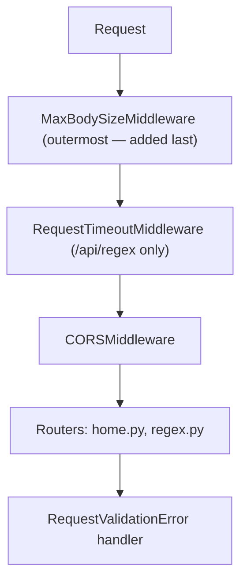

# api-python — Architecture

Internal structure of the Python backend. For the shared cross-engine contract (endpoints,
schemas, error semantics, the full option flag registry), see
[docs/design/api-contract.md](../docs/design/api-contract.md). For a narrative walkthrough of this
backend specifically, see [docs/design/api-python.md](../docs/design/api-python.md).

## 1. Purpose and Tech Stack

One of three interchangeable backends implementing the shared v1 API contract, using only the
Python standard library `re` module (no third-party `regex` package) as its regex engine.

- **Runtime**: Python 3.13 (`pyproject.toml` declares `requires-python = ">=3.11"`; CI/deploy
  target is 3.13)
- **Framework**: FastAPI `0.140.0` (Starlette + Pydantic)
- **Server**: `uvicorn[standard]` `0.51.0` (ASGI)
- **Models**: `pydantic` `2.13.4`
- **Telemetry**: `azure-cosmos` `4.16.2`

## 2. Directory Layout

```
api-python/
├── src/
│   ├── main.py                     # FastAPI app: CORS, middleware registration, exception handlers,
│   │                                # uvicorn entry point (§3, §6)
│   ├── models.py                   # Pydantic request/response models mirroring the v1 contract schemas
│   ├── options.py                  # Option flag registry + bitmask -> `re` flag mapping (§4)
│   ├── routers/
│   │   ├── home.py                 # GET / (redirect), GET /api/capabilities
│   │   └── regex.py                # POST /api/regex — matching + telemetry dispatch via BackgroundTasks
│   ├── services/
│   │   ├── regex_processor.py      # Core `re`-based matching/replace engine (§4, §5)
│   │   ├── capabilities.py         # Builds the GET /api/capabilities response body, ENGINE_KEY
│   │   └── telemetry_service.py    # Cosmos DB telemetry (§7)
│   └── middleware/
│       ├── max_body_size.py        # Enforces maxRequestBodyBytes (8192) -> HTTP 413 (§6)
│       └── request_timeout.py      # 5s HTTP timeout -> HTTP 200 with error body (§5)
├── pyproject.toml
├── requirements.txt
└── README.md
```

## 3. Request Pipeline and Middleware Order

Registered in `main.py` via `app.add_middleware(...)`. Starlette **prepends** each middleware to
the stack, so the *last* one added ends up *outermost* at the ASGI transport level — the order
below is the actual execution order, outermost first:



1. `MaxBodySizeMiddleware` — pure ASGI middleware, added last in `main.py` specifically so it
   wraps the raw transport-level `receive` callable before anything else can read or buffer the
   body (see §6).
2. `RequestTimeoutMiddleware` — bypasses every path except `/api/regex`.
3. `CORSMiddleware` (Starlette's built-in) — allow-list plus, outside production, a regex allowing
   `http(s)://localhost[:port]`.
4. Routing to `routers/home.py` and `routers/regex.py`.
5. FastAPI's `RequestValidationError` exception handler (registered via
   `@app.exception_handler(...)`), which intercepts Pydantic validation failures before they
   become the framework's default 422 response.

## 4. Regex Engine Specifics

`src/options.py`'s `SUPPORTED_RE_FLAGS` maps exactly five contract bits to native `re` flags:
`IgnoreCase`→`re.IGNORECASE`, `Multiline`→`re.MULTILINE`, `Singleline`→`re.DOTALL`,
`IgnorePatternWhitespace`→`re.VERBOSE`, `Ascii`→`re.ASCII`. `to_re_flags()` only iterates this
dict, so every other contract bit (`ExplicitCapture`, `Compiled`, `RightToLeft`, `ECMAScript`,
`CultureInvariant`, `NonBacktracking`, `HasIndices`, `Global`, `Unicode`, `UnicodeSets`, `Sticky`)
is silently ignored rather than rejected. `ShowCaptures` (32768) is tested separately
(`FLAG_SHOW_CAPTURES`) and never reaches `to_re_flags()`.

`regex_processor.py` also performs two textual translations before handing text to `re`, since
Python's regex syntax diverges from .NET/JavaScript's in these two specific ways:

- **Pattern**: `_translate_pattern()` rewrites `.NET`/JavaScript-style named groups `(?<name>...)`
  to Python's required `(?P<name>...)` syntax, via a regex that explicitly excludes lookbehind
  assertions (`(?<=...)`, `(?<!...)`) so those aren't misidentified as named groups.
- **Replacement**: `_convert_replacement()` rewrites `$1` / `${name}` / the literal `$$` escape
  into Python `re.sub` backreference syntax (`\1` / `\g<name>` / `$`), after first doubling any
  literal backslash in the replacement string so it survives `re.sub`'s own backslash processing.

`GET /api/capabilities` reports `features.captures = "single"` — `re.Match` only exposes the last
capture per group, so `ShowCaptures` yields a single-element `captures` array per group/match, the
same as api-nodejs.

The full contract-wide option flag table lives in [CLAUDE.md](../CLAUDE.md) and
[docs/design/api-contract.md](../docs/design/api-contract.md); `src/options.py`'s
`OPTION_REGISTRY` is the runtime source of truth for what this engine actually reports.

## 5. Timeout Implementation

- **Regex timeout (15 s)**: `re` has no native timeout, so `regex_processor.match()` computes a
  `time.monotonic()` deadline before calling `compiled.finditer(text)`, and checks it once per
  match yielded by the loop; on expiry it returns an error message with empty matches. This bounds
  *between-match* time only — a single catastrophically backtracking match cannot be preempted. A
  defensive guard also breaks the loop if a zero-length match ever repeats at the same end
  position (finditer already advances past empty matches on its own, but this is a backstop).
- **Request timeout (5 s)**: `RequestTimeoutMiddleware` wraps `call_next(request)` in
  `asyncio.wait_for(..., timeout=5)`, scoped to `/api/regex` only. On `asyncio.TimeoutError` it
  returns `JSONResponse(200, { error: "...timed out...", replace: null, matches: [] })` — never
  HTTP 408. Because the route handler is a synchronous `def` (FastAPI runs it in a worker thread),
  the timeout cancels *waiting* for that thread's result, not necessarily the thread's execution
  itself — the client-facing response is still returned within 5 s regardless.

## 6. Error Handling, and the 400 / 413 Paths

- **400 (validation)**: `Input`'s Pydantic `Field(max_length=...)` constraints (`pattern` ≤ 512,
  `text`/`replace` ≤ 1024) raise `RequestValidationError` on violation; the custom
  `validation_exception_handler` in `main.py` converts FastAPI's default 422 into an RFC 9457
  ProblemDetails body with `errors: { field: string[] }`.
- **413 (body too large)**: `MaxBodySizeMiddleware` checks `Content-Length` first, rejecting
  immediately if it already declares a size over 8192 bytes without reading any body. Otherwise it
  wraps the ASGI `receive` callable to count bytes as they stream in (catching chunked transfer
  encoding or an understated `Content-Length`), rejecting mid-stream the moment the running total
  crosses 8192. It sends the 413 ProblemDetails response directly via the raw ASGI `send`, then
  signals a client disconnect so the inner app stops reading — all before FastAPI's routing layer
  (which wraps body parsing in a blanket exception handler that would otherwise turn any error,
  including this middleware's, into its own HTTP 400) ever sees the request.
- **Regex errors**: `re.error` raised at compile time, during `finditer` iteration, or during
  `sub()` is caught inside `regex_processor.match()` and returned via the `error` field — always
  HTTP 200, never an HTTP error status.

## 7. Telemetry Integration

`init_cosmos()` (in `services/telemetry_service.py`) is called once at import time in `main.py`
with `COSMOS_CONNECTION_STRING`/`COSMOS_DATABASE`/`COSMOS_CONTAINER` (defaulting to
`regex-tester-db`/`telemetry`). An empty connection string makes it a silent no-op; any other
failure (bad/unreachable connection string) is caught inside `init_cosmos`'s own `try/except` and
logged at warning level, so it can never prevent the app from starting.

Per request, `routers/regex.py` builds the telemetry document via
`telemetry_service.build_document(...)` and schedules the write with
`background_tasks.add_task(send_telemetry, document)` — a FastAPI `BackgroundTasks` callable, which
Starlette guarantees runs only *after* the HTTP response has already been sent. This makes it
fire-and-forget with respect to the response path without needing an explicit unawaited coroutine;
`send_telemetry()` additionally swallows every exception itself (logged at warning level) so a
Cosmos outage can never surface anywhere visible to the client.

The document has 12 fields, matching the other two backends exactly: `id` (`uuid.uuid4()`),
`engineKey` (`ENGINE_KEY` from `capabilities.py` = `"PYTHON"` — the same constant
`GET /api/capabilities` uses), `timestamp` (UTC ISO-8601, via `datetime.now(timezone.utc)`),
`host`, `userAgent`, `pattern`, `text`, `replace`, `options`, `durationMs`, `matchCount`, `error`.
The container is created (if missing) with partition key `/timestamp` and throughput 400 RU/s.

## 8. OpenAPI Generation and Where the Document Is Served

Unlike the other two backends, no custom generator code is needed: FastAPI automatically builds
the OpenAPI document from the Pydantic models (`models.py`) and route decorators
(`response_model=...`, `tags`, `summary`) at runtime. `main.py` configures
`openapi_url="/openapi/v1.json"` and `docs_url="/scalar/v1"` (with `redoc_url=None` to avoid
serving a redundant third docs UI). The checked-in snapshot at
[docs/open-api/api-python.v1.json](../docs/open-api/api-python.v1.json) is a copy of that
generated output.

## 9. Local Development Commands

```powershell
pip install -r requirements.txt                              # Install dependencies
python -m uvicorn src.main:app --port 5200                    # Server at http://localhost:5200
python -m uvicorn src.main:app --reload --port 5200            # Dev server with reload
```

Conformance suite (from `tests/contract/`, against a running instance of this backend):

```powershell
$env:BASE_URL = "http://localhost:5200"; npx vitest run
```

## 10. Related Documentation

- [docs/design/api-python.md](../docs/design/api-python.md) — narrative design doc for this backend
- [docs/design/api-contract.md](../docs/design/api-contract.md) — the shared v1 contract (endpoints, schemas, full option flag table, error semantics)
- [docs/open-api/regex-tester-api.v1.yaml](../docs/open-api/regex-tester-api.v1.yaml) — canonical OpenAPI document
- [../ARCHITECTURE.md](../ARCHITECTURE.md) — system-level architecture
- [../CLAUDE.md](../CLAUDE.md) — repository-wide contributor guide
