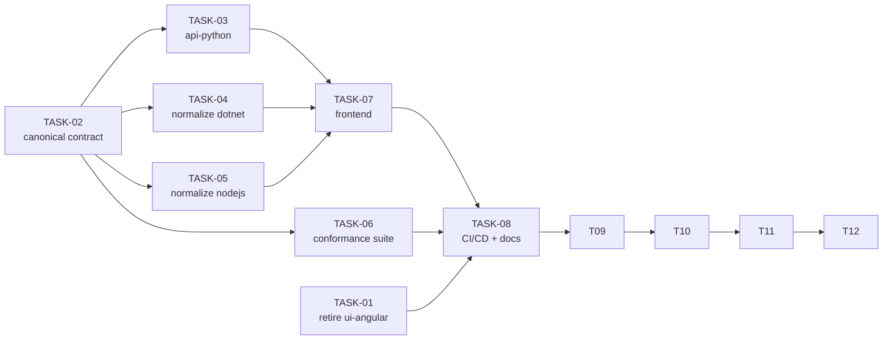

# Task index — Shared v1 API Contract + api-python Backend

Source plan: [docs/plan/2026-07-25-api-contract-and-python-backend.md](../plan/2026-07-25-api-contract-and-python-backend.md)

| Task | Title | Depends on | Status |
|---|---|---|---|
| [TASK-01](TASK-01-retire-ui-angular.md) | Retire all `ui-angular` references | — | Done |
| [TASK-02](TASK-02-canonical-api-contract.md) | Define the canonical v1 API contract | — | Done |
| [TASK-03](TASK-03-api-python.md) | New backend: `api-python` (FastAPI) | 02 | Done |
| [TASK-04](TASK-04-normalize-api-dotnet.md) | Normalize `api-dotnet` to the v1 contract | 02 | Done |
| [TASK-05](TASK-05-normalize-api-nodejs.md) | Normalize `api-nodejs` to the v1 contract | 02 | Done |
| [TASK-06](TASK-06-conformance-test-suite.md) | Cross-backend conformance test suite | 02 | Done |
| [TASK-07](TASK-07-frontend-capability-driven-engines.md) | Frontend: capability-driven engines + Python | 02, 03, 04, 05 | Done |
| [TASK-08](TASK-08-cicd-and-docs.md) | CI/CD workflows and documentation | 01, 03–07 | Done |
| [TASK-09](TASK-09-merge-version-into-capabilities.md) | Merge `/api/version` into `/api/capabilities` | 08 | Done |
| [TASK-10](TASK-10-frontend-hide-unsupported-options.md) | Frontend: hide unsupported options, drop flag badge | 09 | Done |
| [TASK-11](TASK-11-standardize-telemetry.md) | Standardize telemetry across all three backends | 09, 10 | Not started |
| [TASK-12](TASK-12-project-documentation.md) | README, ARCHITECTURE and DEPLOYMENT documentation | 11 | Not started |

## Execution order

**Wave 1** — TASK-01 and TASK-02 (independent, parallel)
**Wave 2** — TASK-03, TASK-04, TASK-05, TASK-06 (parallel; disjoint file sets)
**Wave 3** — TASK-07
**Wave 4** — TASK-08
**Wave 5** — TASK-09
**Wave 6** — TASK-10
**Wave 7** — TASK-11
**Wave 8** — TASK-12

TASK-09 and TASK-10 both modify `ui-vuejs/src/components/RegexTester.vue`, so they must run in
**different waves** even though their concerns are otherwise disjoint. TASK-12 documents the telemetry
behaviour TASK-11 delivers, so it must run after it.

## File ownership

Each task owns a disjoint set of paths so parallel execution cannot conflict.

| Task | Owns |
|---|---|
| TASK-01 | `docs/design/ui-angular.md` (delete), `CLAUDE.md`, `docs/design/ui-vuejs.md`, `api-dotnet/Controllers/*.cs` (XML comments only), `docs/open-api/api-dotnet/` |
| TASK-02 | `docs/open-api/regex-tester-api.v1.yaml`, `docs/design/api-contract.md` |
| TASK-03 | `api-python/**` |
| TASK-04 | `api-dotnet/**`, `docs/open-api/api-dotnet/` |
| TASK-05 | `api-nodejs/**` |
| TASK-06 | `tests/contract/**` |
| TASK-07 | `ui-vuejs/**` |
| TASK-08 | `.github/workflows/**`, `docs/design/*.md`, `CLAUDE.md`, task/plan status fields |
| TASK-09 | `docs/open-api/**`, `docs/design/api-contract.md`, `api-dotnet/**`, `api-nodejs/**`, `api-python/**`, `tests/contract/**`, `.github/workflows/contract-tests.yml`, `ui-vuejs/**` (version fetch only) |
| TASK-10 | `ui-vuejs/src/components/RegexTester.vue`, `ui-vuejs/src/styles.css` |
| TASK-11 | `api-dotnet/Services/**`, `api-dotnet/Controllers/RegexController.cs`, `api-nodejs/src/services/telemetryService.js`, `api-nodejs/src/controllers/regexController.js`, `api-python/src/services/telemetry_service.py`, `api-python/src/routers/regex.py`, `api-python/requirements.txt` |
| TASK-12 | `README.md`, `ARCHITECTURE.md`, `DEPLOYMENT.md`, `api-*/ARCHITECTURE.md`, `docs/design/*.md` (fixes only) |

TASK-01 and TASK-04 both touch `api-dotnet/` and the generated OpenAPI JSON, so they run in **different
waves**. TASK-01 changes only XML doc comment prose; TASK-04 regenerates the OpenAPI JSON afterwards.
