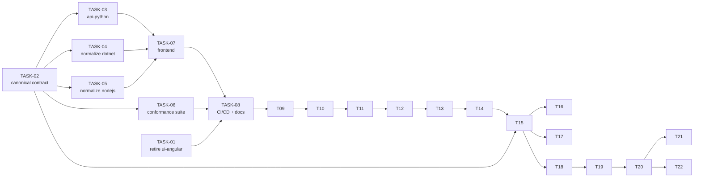

# Task index

Source plans:

- [docs/plan/2026-07-25-api-contract-and-python-backend.md](../plan/2026-07-25-api-contract-and-python-backend.md) — TASK-01 … TASK-13
- [docs/plan/2026-07-25-gate-deploys-on-tests.md](../plan/2026-07-25-gate-deploys-on-tests.md) — TASK-14
- [docs/plan/2026-07-25-add-java-backend.md](../plan/2026-07-25-add-java-backend.md) — TASK-15 … TASK-18
- [docs/plan/2026-07-25-java-pattern-flags.md](../plan/2026-07-25-java-pattern-flags.md) — TASK-19 … TASK-22

| Task | Title | Depends on | Status |
|---|---|---|---|
| [TASK-01](TASK-01-retire-ui-angular.md) | Retire all `ui-angular` references | — | Done |
| [TASK-02](TASK-02-canonical-api-contract.md) | Define the canonical v1 API contract | — | Done |
| [TASK-03](TASK-03-api-python.md) | New backend: `api-python` (FastAPI) | 02 | Done |
| [TASK-04](TASK-04-normalize-api-dotnet.md) | Normalize `api-dotnet` to the v1 contract | 02 | Done |
| [TASK-05](TASK-05-normalize-api-nodejs.md) | Normalize `api-nodejs` to the v1 contract | 02 | Done |
| [TASK-06](TASK-06-conformance-test-suite.md) | Cross-backend conformance test suite | 02 | Done |
| [TASK-07](TASK-07-frontend-capability-driven-engines.md) | Frontend: capability-driven engines + Python | 02, 03, 04, 05 | Done |
| [TASK-08](TASK-08-cicd-and-docs.md) | CI/CD workflows and documentation | 01, 03–07 | Done |
| [TASK-09](TASK-09-merge-version-into-capabilities.md) | Merge `/api/version` into `/api/capabilities` | 08 | Done |
| [TASK-10](TASK-10-frontend-hide-unsupported-options.md) | Frontend: hide unsupported options, drop flag badge | 09 | Done |
| [TASK-11](TASK-11-standardize-telemetry.md) | Standardize telemetry across all three backends | 09, 10 | Done |
| [TASK-12](TASK-12-project-documentation.md) | README, ARCHITECTURE and DEPLOYMENT documentation | 11 | Done |
| [TASK-13](TASK-13-telemetry-partition-key-timestamp.md) | Revert the telemetry partition key to `/timestamp` | 11, 12 | Done |
| [TASK-14](TASK-14-gate-deploys-on-tests.md) | Gate all deployments on a green test suite | 08, 13 | Done |
| [TASK-15](TASK-15-api-java.md) | New backend: `api-java` (Spring Boot) | 02, 14 | Done |
| [TASK-16](TASK-16-frontend-java-engine.md) | Frontend: register the Java engine | 15 | Done |
| [TASK-17](TASK-17-cicd-api-java.md) | CI/CD: `api-java` deploy + contract-test matrix | 15 | Done |
| [TASK-18](TASK-18-docs-api-java.md) | Documentation for `api-java` | 15 | Done |
| [TASK-19](TASK-19-contract-java-pattern-flags.md) | Contract: four new option bits for Java's `Pattern` flags | — | Done |
| [TASK-20](TASK-20-backends-java-pattern-flags.md) | Backends: implement the four new option bits | 19 | Done |
| [TASK-21](TASK-21-frontend-and-conformance-java-pattern-flags.md) | Frontend fallback, conformance tests, spec repair | 20 | Done |
| [TASK-22](TASK-22-docs-java-pattern-flags.md) | Documentation and OpenAPI snapshots for the new flags | 20 | Done |

## Execution order

**Wave 1** — TASK-01 and TASK-02 (independent, parallel)
**Wave 2** — TASK-03, TASK-04, TASK-05, TASK-06 (parallel; disjoint file sets)
**Wave 3** — TASK-07
**Wave 4** — TASK-08
**Wave 5** — TASK-09
**Wave 6** — TASK-10
**Wave 7** — TASK-11
**Wave 8** — TASK-12
**Wave 9** — TASK-13
**Wave 10** — TASK-14
**Wave 11** — TASK-15
**Wave 12** — TASK-16, TASK-17, TASK-18 (parallel; disjoint file sets)
**Wave 13** — TASK-19
**Wave 14** — TASK-20
**Wave 15** — TASK-21, TASK-22 (parallel; disjoint file sets)

TASK-09 and TASK-10 both modify `ui-vuejs/src/components/RegexTester.vue`, so they must run in
**different waves** even though their concerns are otherwise disjoint. TASK-12 documents the telemetry
behaviour TASK-11 delivers, so it must run after it. TASK-13 reverses one TASK-11 decision and must
edit the documents TASK-12 wrote, so it runs after both. TASK-14 rewires the CI/CD workflows TASK-08
created and must gate on the test suite as it stands after TASK-13, so it runs last.

TASK-15 adds a fourth engine, so it must follow TASK-14 — the deploy gate it has to plug into. Its
three follow-ups are strictly downstream of a working backend: TASK-16 needs a live
`/api/capabilities` to render options from, TASK-17 needs the build and start commands, and TASK-18
needs the generated OpenAPI snapshot. Those three own disjoint directories (`ui-vuejs/`,
`.github/workflows/`, docs) and so run in parallel.

TASK-19 allocates new bits in the canonical contract, so it must precede TASK-20 — contract first,
implementations second, or the engines drift. TASK-21 and TASK-22 both need a backend that already
reports the new bits: TASK-21 asserts them over HTTP, TASK-22 regenerates snapshots from a live
server. They own disjoint paths (`ui-vuejs/` + `tests/contract/` versus docs + `api-*/ARCHITECTURE.md`)
and so run in parallel.

## File ownership

Each task owns a disjoint set of paths so parallel execution cannot conflict.

| Task | Owns |
|---|---|
| TASK-01 | `docs/design/ui-angular.md` (delete), `CLAUDE.md`, `docs/design/ui-vuejs.md`, `api-dotnet/Controllers/*.cs` (XML comments only), `docs/open-api/api-dotnet/` |
| TASK-02 | `docs/open-api/regex-tester-api.v1.yaml`, `docs/design/api-contract.md` |
| TASK-03 | `api-python/**` |
| TASK-04 | `api-dotnet/**`, `docs/open-api/api-dotnet/` |
| TASK-05 | `api-nodejs/**` |
| TASK-06 | `tests/contract/**` |
| TASK-07 | `ui-vuejs/**` |
| TASK-08 | `.github/workflows/**`, `docs/design/*.md`, `CLAUDE.md`, task/plan status fields |
| TASK-09 | `docs/open-api/**`, `docs/design/api-contract.md`, `api-dotnet/**`, `api-nodejs/**`, `api-python/**`, `tests/contract/**`, `.github/workflows/contract-tests.yml`, `ui-vuejs/**` (version fetch only) |
| TASK-10 | `ui-vuejs/src/components/RegexTester.vue`, `ui-vuejs/src/styles.css` |
| TASK-11 | `api-dotnet/Services/**`, `api-dotnet/Controllers/RegexController.cs`, `api-nodejs/src/services/telemetryService.js`, `api-nodejs/src/controllers/regexController.js`, `api-python/src/services/telemetry_service.py`, `api-python/src/routers/regex.py`, `api-python/requirements.txt` |
| TASK-12 | `README.md`, `ARCHITECTURE.md`, `DEPLOYMENT.md`, `api-*/ARCHITECTURE.md`, `docs/design/*.md` (fixes only) |
| TASK-13 | `api-dotnet/Services/TelemetryService.cs`, `api-nodejs/src/services/telemetryService.js`, `api-python/src/services/telemetry_service.py`, `DEPLOYMENT.md`, `ARCHITECTURE.md`, `api-*/ARCHITECTURE.md`, `docs/design/api-*.md`, `.github/skills/*/references/conventions.md` (partition-key references only) |
| TASK-14 | `.github/workflows/**`, `DEPLOYMENT.md`, `ARCHITECTURE.md` (CI/CD sections only) |
| TASK-15 | `api-java/**`, `.gitignore` |
| TASK-16 | `ui-vuejs/**` |
| TASK-17 | `.github/workflows/deploy-api-java.yml`, `.github/workflows/contract-tests.yml` |
| TASK-18 | `api-java/ARCHITECTURE.md`, `docs/design/api-java.md`, `docs/design/api-contract.md`, `docs/open-api/api-java.v1.json`, `docs/open-api/README.md`, `README.md`, `ARCHITECTURE.md`, `DEPLOYMENT.md`, `CLAUDE.md` |
| TASK-19 | `docs/design/api-contract.md`, `CLAUDE.md` |
| TASK-20 | `api-dotnet/Models/RegExTesterOptions.cs`, `api-nodejs/src/services/capabilities.js`, `api-python/src/options.py`, `api-java/src/main/java/io/github/regextester/api/options/RegexOptions.java` |
| TASK-21 | `tests/contract/src/specs/**`, `ui-vuejs/src/config.java.js` |
| TASK-22 | `docs/design/api-dotnet.md`, `docs/design/api-nodejs.md`, `docs/design/api-python.md`, `docs/design/api-java.md`, `api-*/ARCHITECTURE.md`, `docs/open-api/*.v1.json` |

TASK-01 and TASK-04 both touch `api-dotnet/` and the generated OpenAPI JSON, so they run in **different
waves**. TASK-01 changes only XML doc comment prose; TASK-04 regenerates the OpenAPI JSON afterwards.
